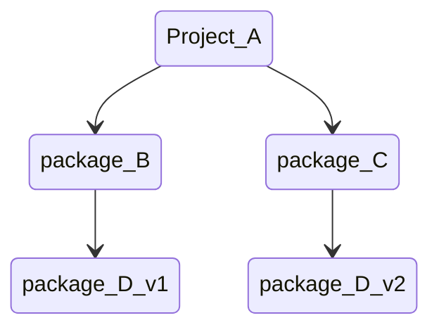

# GO 依赖管理机制

围绕着解决

+   不同环境（项目）依赖的版本不同

    >   两个项目同时依赖同一个库不同版本 **GOPATH** 无法解决  **Go Vender 和 Go Module** 可以

+   控制依赖库的版本

+   

## GOPATH

所有项目代码都直接依赖 src 下的代码


**弊端：**无法实现两个项目依赖同一个 package 的不同版本

## Go  Vendor

每个项目下都会有一个 vendor 目录所有依赖包副本都存放在  $ProjectRoot/vendor 下

依赖寻址方式： vendor -->  GOPATH

解决了不同项目依赖同一个 package 不同版本的问题

**弊端：**项目A 依赖 package B 和 package C , package B 依赖 package D-V1 



## Go Module 

+   通过 go.mod 文件管理依赖包版本
+   通过 go get / go mod 指令工具管理依赖包

实现 ：定义版本规则和管理项目依赖关系

1.   配置文件，描述依赖  go.mod
2.   中心仓库管理依赖库  Proxy
3.   本地工具                     go mod/get

```go
module github.com/project/app 

go 1.18

require github.com/avast/retry-go v3.0.0+incompatible
```

