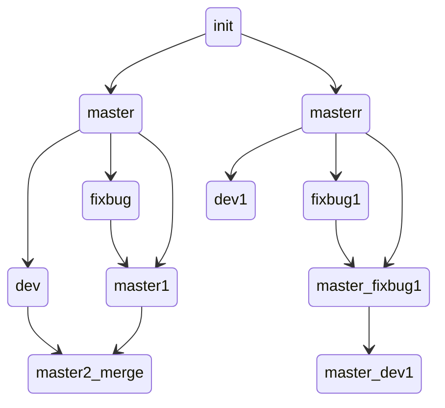

# learn git

### git branch
> git switch -c branchName  //创建分支
> git switch branchName     //切换分支
> git merge dev  //将dev合并到当前分支

git cherry-pick 4e8f(提交节点名)   //将此提交在当前分支重做一遍  常用与修bug

git rebase <branch>  //[doc](https://git-scm.com/docs/git-rebase)

https://learngitbranching.js.org/?locale=zh_CN

```shell
git commit --amend  # 将暂存区中的内容提交到上一次commit，不会新增commit节点
git rebase <branch> # 变基到 <branch> 分支，
```



```shell
git rebase -i HEADE~n/commit_id   #将多个commit 合并为一个或调整顺序，更改commit msg

# squash
```

